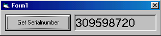

<div align="center">

## Get Serialnumber from a harddisk


</div>

### Description

Get the Serialnumber from your harddisk, cd rom or your disks.
 
### More Info
 
Make a label named label1 and an commandbutton named command1.


<span>             |<span>
---                |---
**Submitted On**   |
**By**             |[Manuel W\.](https://github.com/Planet-Source-Code/PSCIndex/blob/master/ByAuthor/manuel-w.md)
**Level**          |Intermediate
**User Rating**    |4.5 (36 globes from 8 users)
**Compatibility**  |VB 3\.0, VB 4\.0 \(16\-bit\), VB 4\.0 \(32\-bit\), VB 5\.0, VB 6\.0
**Category**       |[Files/ File Controls/ Input/ Output](https://github.com/Planet-Source-Code/PSCIndex/blob/master/ByCategory/files-file-controls-input-output__1-3.md)
**World**          |[Visual Basic](https://github.com/Planet-Source-Code/PSCIndex/blob/master/ByWorld/visual-basic.md)
**Archive File**   |[](https://github.com/Planet-Source-Code/manuel-w-get-serialnumber-from-a-harddisk__1-7364/archive/master.zip)


### Source Code

```
Option Explicit
Private Declare Function GetVolumeInformation& Lib "kernel32" _
    Alias "GetVolumeInformationA" (ByVal lpRootPathName _
    As String, ByVal pVolumeNameBuffer As String, ByVal _
    nVolumeNameSize As Long, lpVolumeSerialNumber As Long, _
    lpMaximumComponentLength As Long, lpFileSystemFlags As _
    Long, ByVal lpFileSystemNameBuffer As String, ByVal _
    nFileSystemNameSize As Long)
Const MAX_FILENAME_LEN = 256
Private Sub Command1_Click()
 Label1.Caption = SerNum("C") 'C is the standard harddisk
End Sub
Public Function SerNum(Drive$) As Long
 Dim No&, s As String * MAX_FILENAME_LEN
  Call GetVolumeInformation(Drive + ":\", s, MAX_FILENAME_LEN, _
               No, 0&, 0&, s, MAX_FILENAME_LEN)
  SerNum = No
End Function
Private Sub Form_Load()
End Sub
```

